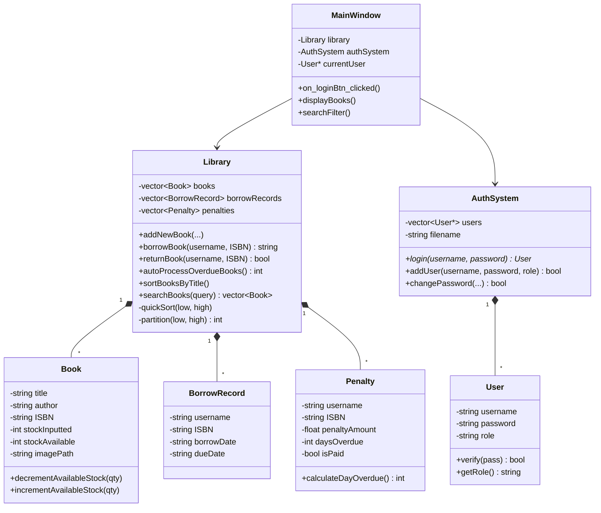

<div align="center">

# 📚 Modern Desktop Library Management System (LMS)

### High-Performance Desktop Library & Inventory Application Built with C++ and Qt Framework

[](https://isocpp.org/)
[](https://www.qt.io/)
[](https://en.wikipedia.org/wiki/Object-oriented_programming)
[](https://en.wikipedia.org/wiki/Quicksort)
[](LICENSE)

<br/>

</div>

---

## 📖 Table of Contents
- [Project Overview](#-project-overview)
- [Core Features](#-core-features)
- [Software Architecture & Domain Model](#-software-architecture--domain-model)
- [Algorithmic & Technical Highlights](#-algorithmic--technical-highlights)
- [Repository Structure](#-repository-structure)
- [Getting Started & Build Instructions](#-getting-started--build-instructions)
- [Author & Contributions](#-author--contributions)
- [License](#-license)

---

## 📌 Project Overview

The **Library Management System (LMS)** is a comprehensive desktop software solution designed for academic and institutional libraries. Engineered in **C++** with the **Qt GUI Framework**, the application provides robust cataloging, book checkout/return lifecycles, role-based user access control, automatic overdue penalty computation, and high-performance search and sorting.

Built with strict adherence to **Object-Oriented Programming (OOP)** principles, the codebase emphasizes data encapsulation, modularity, and clean separation between business logic and UI event loops.

---

## ✨ Core Features

| Module | Features & Capabilities |
| :--- | :--- |
| 🔐 **Authentication & RBAC** | Role-Based Access Control supporting **Admin** and **Member/Student** roles with password verification and session tracking. |
| 📖 **Inventory & Cataloging** | Full CRUD for book entries: Title, Author, Publication Year, Price, ISBN-13, total inventory, available stock, and dynamic cover image previews. |
| 🔄 **Circulation & Lending** | Seamless book checkout and check-in workflows. Real-time stock decrementing/incrementing with validation against double-borrowing. |
| ⏱️ **Automated Penalty Engine** | Scheduled detection of overdue loans (`autoProcessOverdueBooks`), precise day calculation, automated fee billing, and settlement tracking. |
| ⚡ **Search & Custom Sort** | Multi-attribute search (by ISBN, Title, Author, Year, Price range) powered by an in-memory **QuickSort** algorithm for instantaneous catalog reordering. |
| 💾 **Data Persistence** | Flat-file storage engine maintaining synchronized persistence for book records, lending history, user accounts, and penalty journals. |
| 🖥️ **Dual Interface Support** | Available in both a rich **Qt 6 Desktop GUI** and a lightweight, portable **Pure C++17 Console (CLI)** edition with zero external UI dependencies. |

---

## 🔬 Software Architecture & Domain Model

The system follows a layered architecture dividing the GUI view layer from domain models and data access:



---

## 🛠️ Algorithmic & Technical Highlights

### 1. In-Memory QuickSort Algorithm
Rather than relying solely on black-box utilities, book title sorting is driven by an internal **Divide-and-Conquer QuickSort** implementation optimized for standard C++ vectors:
* **Average Time Complexity**: $\mathcal{O}(n \log n)$
* **Partitioning**: Hoare/Lomuto partitioning scheme minimizing memory swaps (`swapBooks`) during runtime sorting.

### 2. Automated Overdue Detection & Fine Calculation
The `Library::autoProcessOverdueBooks()` pipeline scans active borrow records against system calendar dates (`QDate`), calculating elapsed overdue days and generating penalty ledger entries seamlessly without requiring manual librarian audits.

### 3. Encapsulation & Safe Memory Management
* `AuthSystem` manages dynamic `User*` allocations with clear ownership and clean destructor deallocations.
* Book stock invariants are guarded via guarded mutators (`incrementAvailableStock`, `decrementAvailableStock`), eliminating negative stock states.

---

## 📁 Repository Structure

```
LMS/
├── cli/                            # Standalone C++ Console / CLI Edition
│   ├── library_management_system.cpp  # Pure C++17 STL terminal application
│   ├── InputBooks.txt              # CLI catalog dataset
│   ├── Borrowed_Books_Record.txt   # CLI circulation records
│   └── books.txt                   # Flat-file database storage
├── LibraryManagementSystem.pro     # Qt Project configuration
├── main.cpp                        # Entry point
├── mainwindow.cpp / .h / .ui       # Primary GUI interface and table widgets
├── authsystem.cpp / .h             # User authentication and credentials verification
├── user.cpp / .h                   # User entity & permission definition
├── library.cpp / .h                # Core business logic, QuickSort, and catalog APIs
├── book.cpp / .h                   # Book data representation & stock rules
├── borrowrecord.cpp / .h           # Circulation and loan transaction entity
├── penalty.cpp / .h                # Overdue penalty computation engine
├── covers/                         # Image directory for book cover art
├── InputBooks.txt                  # Seed database: book catalog
├── users.txt                       # Seed database: user accounts & roles
├── Borrowed_Books_Record.txt       # Seed database: loan transactions
├── penalty.txt                     # Seed database: overdue fines
├── LICENSE                         # MIT License
└── README.md                       # Technical documentation
```

---

## 🚀 Getting Started & Build Instructions

### Option 1: Desktop GUI Edition (Qt 6)
**Prerequisites:** Qt 5.15+ or Qt 6.x with Qt Creator IDE.

1. **Clone the repository:**
   ```bash
   git clone https://github.com/linh-nguyen123/LMS.git
   cd LMS
   ```
2. **Open & Build in Qt Creator:**
   * Launch Qt Creator and select **Open Project**.
   * Select `LibraryManagementSystem.pro`.
   * Choose `Desktop Qt 6.x (MinGW 64-bit)` as the build kit.
   * Press `Ctrl + B` to build, then `Ctrl + R` to run.

### Option 2: Standalone Console CLI Edition (Pure C++17)
**Prerequisites:** Any standard C++17 compiler (GCC / Clang / MSVC). Zero external dependencies!

```bash
cd LMS/cli
g++ -std=c++17 library_management_system.cpp -o LMS_CLI
./LMS_CLI
```

---

## 👨‍💻 Author & Contributions
- **Author**: Nguyen Linh (Lucas)
- **GitHub**: [@linh-nguyen123](https://github.com/linh-nguyen123)
- **Contributions**: Suggestions, issue reporting, and pull requests are warmly welcomed!

---

## 📄 License
Distributed under the **MIT License**. See `LICENSE` for details.
